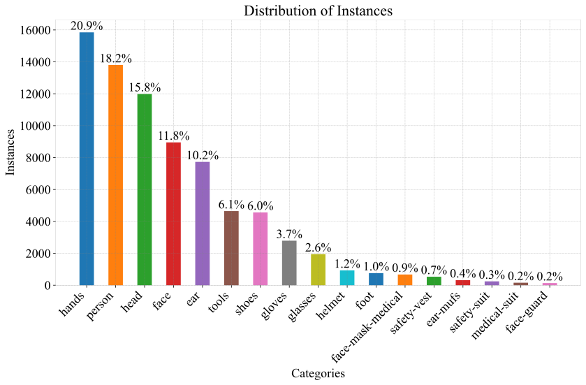

# **SH17: A Dataset for Human Safety and Personal Protective Equipment Detection in Manufacturing Industry**
[](https://arxiv.org/abs/2407.04590)
[](https://doi.org/10.1016/j.jnlssr.2024.09.002)
[](https://www.kaggle.com/datasets/mugheesahmad/sh17-dataset-for-ppe-detection)


---
## 📢 Latest Updates
- **2024-11-28**" Official Paper has been accepted and published by Journal of Safety Science and Resilience [and is available here.](http://dx.doi.org/10.1016/j.jnlssr.2024.09.002)
- **2024-07-19**" Tutorial on training a YOLOv8n model is available [here](https://www.kaggle.com/code/mugheesahmad/tutorial-to-train-a-yolov8n-model)
- **2024-07-05**: Paper is now available at [ArXiv](https://arxiv.org/abs/2407.04590).
- **2024-07-04**: The data is now available at [kaggle](https://www.kaggle.com/datasets/mugheesahmad/sh17-dataset-for-ppe-detection).
---

## **Table of Contents**
1. [Abstract](##abstract)
2. [Dataset](#dataset) ([download](https://www.kaggle.com/datasets/mugheesahmad/sh17-dataset-for-ppe-detection))
4. [Models](#models)
5. [Citation](#citation)
6. [License](#license)

---

## **Abstract**

Workplace accidents continue to pose significant risks for human safety, particularly in industries such as construction and manufacturing, and the necessity for effective Personal Protective Equipment (PPE) compliance has become increasingly paramount. Our research focuses on the development of non-invasive techniques based on the Object Detection (OD) and Convolutional Neural Network (CNN) to detect and verify the proper use of various types of PPE such as helmets, safety glasses, masks, and protective clothing. This study proposes the SH17 Dataset, consisting of 8,099 annotated images containing 75,994 instances of 17 classes collected from diverse industrial environments, to train and validate the OD models. We have trained state-of-the-art OD models for benchmarking, and initial results demonstrate promising accuracy levels with You Only Look Once (YOLO)v9-e model variant exceeding 70.9% in PPE detection. The performance of the model validation on cross-domain datasets suggests that integrating these technologies can significantly improve safety management systems, providing a scalable and efficient solution for industries striving to meet human safety regulations and protect their workforce.

---
## Download the dataset !!!

The images and annotated labels can be found in [Kaggle](https://www.kaggle.com/datasets/mugheesahmad/sh17-dataset-for-ppe-detection).

All images can be downloaded via list of URLs from the source using [download_from_pexels.py](data/download_from_pexels.py) script. 
```
cd data
python download_from_pexels.py
```
---

## Dataset

The SH17 dataset consists of:
- 8,099 annotated images 
- 75,994 object instances
- 17 classes of PPE items and body parts

---

### Key features
- Collected from diverse industrial environments globally
- High quality images (max resolution 8192x5462, min 1920x1002)
- Average of 9.38 instances per image
- Includes small objects like ears and earmuffs (39,764 annotations < 1% image area, 59,025 annotations < 5% area)

---

## Classes
1. Person
2. Head  
3. Face
4. Glasses
5. Face-mask-medical
6. Face-guard
7. Ear
8. Earmuffs
9. Hands
10. Gloves
11. Foot
12. Shoes  
13. Safety-vest
14. Tools
15. Helmet
16. Medical-suit
17. Safety-suit

---

## Class distribution



---

## Models

We have used [ultralytics==8.0.38](https://github.com/ultralytics/ultralytics) repository for training of all the yolo models. We provide trained weights for evaluation and benchmarking purposes for yolo v8, v9, and v10 object detection models.

you can install ultralytics using `pip install ultralytics=8.0.38` 
and weights can be downloaded by clicking model in the table below or from the [releases section](https://github.com/ahmadmughees/SH17dataset/releases). 

---

### YOLO v8, v9, v10 Results

| Model                                                                                    | Params | Images | Instances | P        | R        | mAP50    | mAP50-95 |
|------------------------------------------------------------------------------------------|--------|--------|-----------|----------|----------|----------|----------|
| [Yolo-8-n](https://github.com/ahmadmughees/SH17dataset/releases/download/v1/yolo8n.pt)   | 3.2    | 1620   | 15358     | 67.5     | 53.6     | 58.0     | 36.6     |
| [Yolo-8-s](https://github.com/ahmadmughees/SH17dataset/releases/download/v1/yolo8s.pt)   | 11.2   | 1620   | 15358     | 81.5     | 55.7     | 63.7     | 41.7     |
| [Yolo-8-m](https://github.com/ahmadmughees/SH17dataset/releases/download/v1/yolo8m.pt)   | 25.9   | 1620   | 15358     | 77.1     | 60.5     | 66.6     | 45.7     |
| [Yolo-8-l](https://github.com/ahmadmughees/SH17dataset/releases/download/v1/yolo8l.pt)   | 43.7   | 1620   | 15358     | 76.7     | 62.9     | 68.0     | 47.0     |
| [Yolo-8-x](https://github.com/ahmadmughees/SH17dataset/releases/download/v1/yolo8x.pt)   | 68.2   | 1620   | 15358     | 77.1     | 63.1     | 69.3     | 47.2     |
| [Yolo-9-t](https://github.com/ahmadmughees/SH17dataset/releases/download/v1/yolo9t.pt)   | 2.0    | 1620   | 15358     | 75.0     | 52.6     | 58.5     | 37.5     |
| [Yolo-9-s](https://github.com/ahmadmughees/SH17dataset/releases/download/v1/yolo9s.pt)   | 7.2    | 1620   | 15358     | 73.6     | 60.2     | 65.3     | 42.9     |
| [Yolo-9-m](https://github.com/ahmadmughees/SH17dataset/releases/download/v1/yolo9m.pt)   | 20.1   | 1620   | 15358     | 77.4     | 62.0     | 68.6     | 46.5     |
| [Yolo-9-c](https://github.com/ahmadmughees/SH17dataset/releases/download/v1/yolo9c.pt)   | 25.5   | 1620   | 15358     | 79.6     | 60.8     | 67.7     | 46.5     |
| [Yolo-9-e](https://github.com/ahmadmughees/SH17dataset/releases/download/v1/yolo9e.pt)   | 58.1   | 1620   | 15358     | **81.0** | **65.0** | **70.9** | **48.7** |
| [Yolo-10-n](https://github.com/ahmadmughees/SH17dataset/releases/download/v1/yolo10n.pt) | 2.3    | 1620   | 15358     | 66.8     | 53.2     | 57.2     | 35.9     |
| [Yolo-10-s](https://github.com/ahmadmughees/SH17dataset/releases/download/v1/yolo10s.pt) | 7.2    | 1620   | 15358     | 75.8     | 57.0     | 62.7     | 40.9     |
| [Yolo-10-m](https://github.com/ahmadmughees/SH17dataset/releases/download/v1/yolo10m.pt) | 15.4   | 1620   | 15358     | 71.4     | 61.4     | 65.7     | 43.8     |
| [Yolo-10-b](https://github.com/ahmadmughees/SH17dataset/releases/download/v1/yolo10b.pt) | 19.1   | 1620   | 15358     | 77.7     | 59.1     | 65.8     | 45.1     |
| [Yolo-10-l](https://github.com/ahmadmughees/SH17dataset/releases/download/v1/yolo10l.pt) | 24.4   | 1620   | 15358     | 76.0     | 61.8     | 67.4     | 46.0     |
| [Yolo-10-x](https://github.com/ahmadmughees/SH17dataset/releases/download/v1/yolo10x.pt) | 29.5   | 1620   | 15358     | 76.8     | 62.8     | 67.8     | 46.7     |

---

## Update train_files.txt and test_files.txt

The `train_files.txt` and `test_files.txt` with the dataset contains only list of images while in the YOLO format it needs full image path, so append the full path within each file. You can use [update_train_test_files.py](data/update_train_test_files.py) script to achieve that. 
After that your files should have the structure as below,
```
\full\path\to\images\pexels-photo-11739107.jpeg
\full\path\to\images\pexels-photo-6766248.jpeg
\full\path\to\images\pexels-photo-7674606.jpeg
\full\path\to\images\pexels-photo-7222236.jpeg
\full\path\to\images\pexels-photo-8837596.jpeg
...
```

## Usage
```python
from ultralytics import YOLO

model = YOLO(r"\path\to\weight.pt")  # provide path to the trained model 
results = model('path\of\image')  # Run inference

results.show()  # View results
```
For more usage details please refer to [ultralytics docs](https://docs.ultralytics.com/modes/predict/). 

---

## Evaluation

We provide evaluation code to reproduce our benchmark results on the SH17 validation set.

```python
from ultralytics import YOLO

model = YOLO(r"\path\to\weight.pt")
model.val(data="sh17.yaml", batch = 1, imgsz = 640, device="cuda:0")
```


## Kaggle

Tutorial on training a YOLOv8n model on SH17 dataset is available [here](https://www.kaggle.com/code/mugheesahmad/tutorial-to-train-a-yolov8n-model). 

---

## Citation

If you use this dataset or code in your research, please cite our paper:

```latex
@article{AHMAD2024,
    title = {SH17: A dataset for human safety and personal protective equipment detection in manufacturing industry},
    journal = {Journal of Safety Science and Resilience},
    year = {2024},
    issn = {2666-4496},
    doi = {https://doi.org/10.1016/j.jnlssr.2024.09.002},
    url = {https://www.sciencedirect.com/science/article/pii/S266644962400077X},
    author = {Hafiz Mughees Ahmad and Afshin Rahimi},
}
```
## License

The SH17 dataset is released under [CC BY-NC-SA 4.0](https://creativecommons.org/licenses/by-nc-sa/4.0/) license.


### Disclaimer and Responsible Use:
This dataset, scrapped through the Pexels website, is intended for educational, research, and analysis purposes only. You may be able to use the data for training of the Machine learning models only.  Users are urged to use this data responsibly, ethically, and within the bounds of legal stipulations.

### Users should adhere to [Copyright Notice of Pexels ](https://www.pexels.com/license/) when utilizing this dataset.

Legal Simplicity: All photos and videos on Pexels can be downloaded and used for free.

### Allowed 👌
- All photos and videos on Pexels are free to use.
- Attribution is not required. Giving credit to the photographer or Pexels is not necessary but always appreciated.
- You can modify the photos and videos from Pexels. Be creative and edit them as you like.
### Not allowed 👎
- Identifiable people may not appear in a bad light or in a way that is offensive.
- Don't sell unaltered copies of a photo or video, e.g. as a poster, print or on a physical product without modifying it first.
- Don't imply endorsement of your product by people or brands on the imagery.
- Don't redistribute or sell the photos and videos on other stock photo or wallpaper platforms.
- Don't use the photos or videos as part of your trade-mark, design-mark, trade-name, business name or service mark.


### No Warranty Disclaimer: 
The dataset is provided "as is," without warranty, and the creator disclaims any legal liability for its use by others.

### Ethical Use: 
Users are encouraged to consider the ethical implications of their analyses and the potential impact on broader community.

---
## Contact

For any questions or concerns, please open an issue in this repository or contact *mughees* at `ahmad54@uwindsor.ca`

## Acknowledgement

Training of all the models is done using [ultralytics](https://github.com/ultralytics/ultralytics) repository. Thanks for the great implementations!